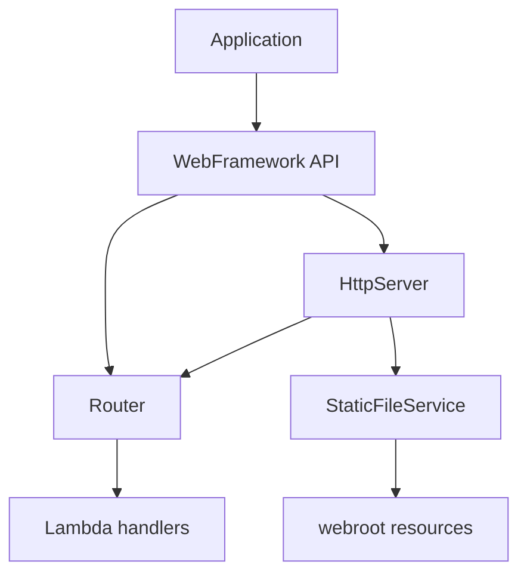

# Maintainable Application Server

Small, sequential Java application server built for the AREP lambda-based web framework lab. The project serves HTML, CSS, JavaScript and an image from the classpath, while application developers register GET services with Java lambdas.

## Architecture



The framework is organized as follows:

- `Application`: application-specific routes and environment configuration.
- `WebFramework`: small public API exposing `get`, `staticfiles`, `start`, and `stop`.
- `Router`: maps an HTTP method and path to a lambda.
- `HttpServer`: accepts one socket at a time and writes HTTP responses.
- `Request` and `Response`: HTTP data passed to handlers.
- `StaticFileService`: reads safe resources from `src/main/resources/webroot` and preserves binary bytes.

### Office-building metaphor

The HTTP server is the building entrance and receptionist: it receives each visitor and reads the request. The router is the lobby directory that identifies the destination. Each lambda is an individual office responsible for one service. The static-file service is the document archive containing HTML, CSS, JavaScript and images. Environment variables are the building's deployment configuration. During shutdown, the receptionist finishes serving the current visitor, closes that connection, and then closes the building.

The server is intentionally sequential: there is no worker thread, executor, pool, or asynchronous server-side processing.

## Run locally

Requirements: Java 17 and Maven 3.9+.

```powershell
mvn clean test
mvn package
java -cp target/classes co.edu.escuelaing.app.Application
```

The default port is `8080`. Open `http://localhost:8080/` or use:

```powershell
curl.exe http://localhost:8080/index.html
curl.exe http://localhost:8080/styles.css
curl.exe http://localhost:8080/images/server.svg
curl.exe "http://localhost:8080/hello?name=Pedro"
curl.exe http://localhost:8080/pi
curl.exe http://localhost:8080/unknown
```

Expected dynamic responses include `Hello Pedro` and the value of `Math.PI`. An unknown path returns HTTP 404 and `404 Not Found`.

### Environment variables

| Variable | Purpose | Local default |
|---|---|---|
| `PORT` | HTTP listening port | `8080` |
| `GREETING_PREFIX` | Prefix used by `/hello` | `Hello` |
| `APP_ENV` | Enables development-only `/shutdown` | `development` |
| `STATIC_FILES_PATH` | Classpath root for static resources | `/webroot` |

Example:

```powershell
$env:PORT = "8080"
$env:GREETING_PREFIX = "Hola"
$env:APP_ENV = "development"
java -cp target/classes co.edu.escuelaing.app.Application
```

The development-only shutdown route is:

```powershell
curl.exe http://localhost:8080/shutdown
```

The handler returns `Server will stop after this response.`, closes the current client connection, and then the sequential loop exits. In production, set `APP_ENV=production`; the route is not registered and returns 404.

## Cloud deployment with AWS Academy Learner Lab

The included `Dockerfile` can be deployed on an EC2 instance. AWS Academy provides temporary credentials, so never commit them, place them in the README, or expose them in screenshots.

### 1. Create the EC2 instance

In the AWS Academy Learner Lab console, start the lab and open **EC2**:

1. Launch an instance using Amazon Linux 2023 and a small instance type allowed by the lab, such as `t3.micro`.
2. Create or select a key pair. Keep the private key outside the repository.
3. In the security group, allow SSH `22` only from your IP and custom TCP `8080` from `0.0.0.0/0` for the demonstration.
4. Launch the instance and copy its public IPv4 address.

For the lab, the public URL will be `http://PUBLIC_IPV4:8080`.

### 2. Install Docker and run the application

Connect using EC2 Instance Connect in the AWS console, or SSH from a machine that has the key pair. Then run:

```bash
sudo dnf install -y docker git
sudo systemctl enable --now docker
sudo usermod -aG docker ec2-user
newgrp docker
git clone https://github.com/YOUR_USERNAME/YOUR_REPOSITORY.git
cd YOUR_REPOSITORY
docker build -t maintainable-server .
docker run -d --name maintainable-server --restart unless-stopped \
    -p 8080:8080 \
    -e PORT=8080 \
    -e APP_ENV=production \
    -e GREETING_PREFIX="Hello from AWS Academy" \
    maintainable-server
```

The application binds to all interfaces through `ServerSocket`, and the EC2 security group exposes it on port `8080`. Check the container with `docker ps` and `docker logs maintainable-server`.

### 3. Verify the deployment

Replace `PUBLIC_IPV4` with the instance address:

```bash
curl -i http://PUBLIC_IPV4:8080/
curl -i http://PUBLIC_IPV4:8080/styles.css
curl -i http://PUBLIC_IPV4:8080/images/server.svg
curl -i "http://PUBLIC_IPV4:8080/hello?name=Cloud"
curl -i http://PUBLIC_IPV4:8080/pi
curl -i http://PUBLIC_IPV4:8080/unknown
curl -i http://PUBLIC_IPV4:8080/shutdown
```

The first five valid paths must return 200, `/unknown` must return 404, and `/shutdown` must return 404 because the container uses `APP_ENV=production`. Capture the deployed page, one static resource, both REST responses, the 404 response, and the environment configuration (`APP_ENV=production` and the greeting prefix, without secrets) for the report.

**Public deployment URL:** `REPLACE_WITH_EC2_PUBLIC_URL`

Use `http://PUBLIC_IPV4:8080` as the value after launching the instance. The public IPv4 address can change when the instance is stopped and started; update this README and the evidence if that happens. Stop the EC2 instance after collecting evidence so the temporary lab quota is not consumed unnecessarily.

## Evidence and tests

The automated tests cover decoded multiple query parameters, missing values, GET route lookup, unknown routes, static HTML loading, content types, and path traversal rejection. `mvn clean test` is the repeatable local evidence command.

Manual local evidence to capture for the report:

- Page: `/` or `/index.html`.
- Static resources: `/styles.css`, `/app.js`, and `/images/server.svg`.
- Lambda endpoints: `/hello?name=Pedro` and `/pi`.
- Error response: `/unknown` with HTTP 404.
- Graceful development shutdown: `/shutdown` followed by a stopped process.
- Production protection: `/shutdown` with `APP_ENV=production`, returning HTTP 404.

## Maintainability

A new application endpoint is added with one `get(path, lambda)` registration in `Application`; the socket-processing loop does not change. Routing, request parsing, static files, response formatting, and lifecycle control each have one focused responsibility. The same Maven artifact runs locally and in the Docker image, with deployment differences supplied through environment variables.
