# Maintainable Application Server

Small, sequential Java application server built for the AREP lambda-based web framework lab. The project serves HTML, CSS, JavaScript and an image from the classpath, while application developers register GET services with Java lambdas.

## Autor

Deisy Lorena Guzmán Cabrales

## Architecture

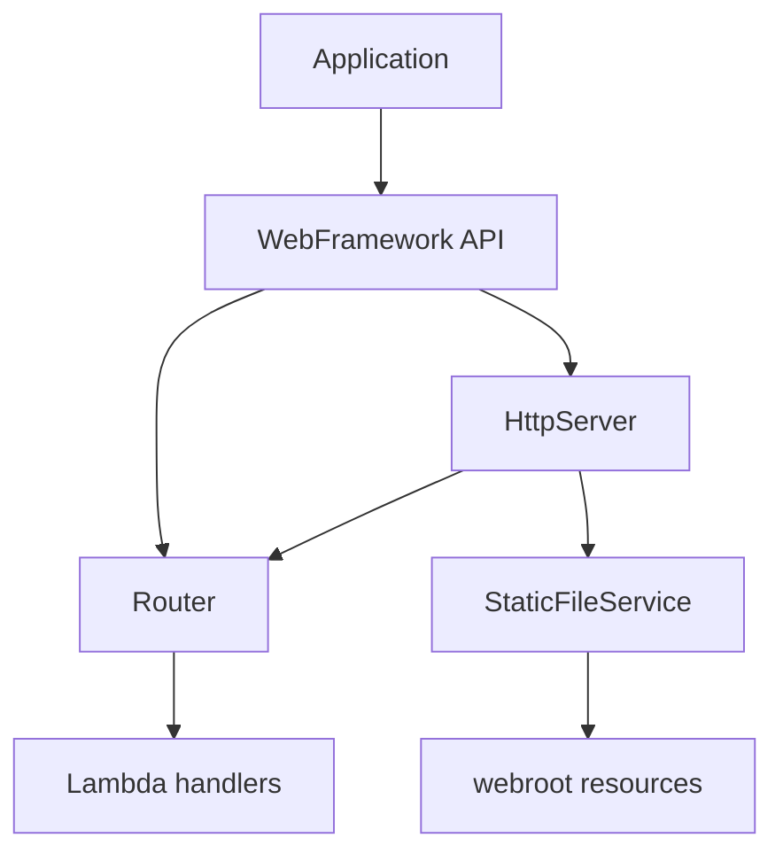

The framework is organized as follows:

- `Application`: application-specific routes and environment configuration.
- `WebFramework`: small public API exposing `get`, `staticfiles`, `start`, and `stop`.
- `Router`: maps an HTTP method and path to a lambda.
- `HttpServer`: accepts one socket at a time and writes HTTP responses.
- `Request` and `Response`: HTTP data passed to handlers.
- `StaticFileService`: reads safe resources from `src/main/resources/webroot` and preserves binary bytes.

### Office-building metaphor

The HTTP server is the building entrance and receptionist: it receives each visitor and reads the request. The router is the lobby directory that identifies the destination. Each lambda is an individual office responsible for one service. The static-file service is the document archive containing HTML, CSS, JavaScript and images. Environment variables are the building's deployment configuration. During shutdown, the receptionist finishes serving the current visitor, closes that connection, and then closes the building.

The server is intentionally sequential: there is no worker thread, executor, pool, or asynchronous server-side processing.

## Run locally

Requirements: Java 17 and Maven 3.9+.

```powershell
mvn clean test
mvn package
java -cp target/classes co.edu.escuelaing.app.Application
```

The default port is `8080`. Open `http://localhost:8080/` or use:

```powershell
curl.exe http://localhost:8080/index.html
curl.exe http://localhost:8080/styles.css
curl.exe http://localhost:8080/images/server.svg
curl.exe "http://localhost:8080/hello?name=Pedro"
curl.exe http://localhost:8080/pi
curl.exe http://localhost:8080/unknown
```

Expected dynamic responses include `Hello Pedro` and the value of `Math.PI`. An unknown path returns HTTP 404 and `404 Not Found`.

### Environment variables

| Variable | Purpose | Local default |
|---|---|---|
| `PORT` | HTTP listening port | `8080` |
| `GREETING_PREFIX` | Prefix used by `/hello` | `Hello` |
| `APP_ENV` | Enables development-only `/shutdown` | `development` |
| `STATIC_FILES_PATH` | Classpath root for static resources | `/webroot` |

Example:

```powershell
$env:PORT = "8080"
$env:GREETING_PREFIX = "Hola"
$env:APP_ENV = "development"
java -cp target/classes co.edu.escuelaing.app.Application
```

The development-only shutdown route is:

```powershell
curl.exe http://localhost:8080/shutdown
```

The handler returns `Server will stop after this response.`, closes the current client connection, and then the sequential loop exits. In production, set `APP_ENV=production`; the route is not registered and returns 404.

## Cloud deployment: AWS Academy Learner Lab

The application is deployed in an Amazon EC2 instance using the included `Dockerfile`.

**Public deployment URL:** http://13.218.105.19:8080

The EC2 instance runs Amazon Linux with Docker. Its Security Group allows SSH on port `22` and public TCP traffic on port `8080`. The container is configured with:

```text
PORT=8080
APP_ENV=production
GREETING_PREFIX=Hello from AWS Academy
```

The deployment can be reproduced with:

```bash
git clone https://github.com/YOUR_USERNAME/YOUR_REPOSITORY.git
cd YOUR_REPOSITORY
sudo dnf install -y docker git
sudo systemctl enable --now docker
sudo usermod -aG docker ec2-user
newgrp docker
docker build -t maintainable-server .
docker run -d --name maintainable-server --restart unless-stopped \
    -p 8080:8080 \
    -e PORT=8080 \
    -e APP_ENV=production \
    -e GREETING_PREFIX="Hello from AWS Academy" \
    maintainable-server
```

The public IPv4 address may change if the EC2 instance is stopped and restarted. If that happens, update the URL above and the evidence links.

## Tests

The automated tests cover decoded multiple query parameters, missing values, GET route lookup, unknown routes, static HTML loading, content types, root-page rendering, and path traversal rejection. Run them with:

```powershell
mvn clean test
```

## Maintainability

A new application endpoint is added with one `get(path, lambda)` registration in `Application`; the socket-processing loop does not change. Routing, request parsing, static files, response formatting, and lifecycle control each have one focused responsibility. The same Maven artifact runs locally and in the Docker image, with deployment differences supplied through environment variables.

## Evidence

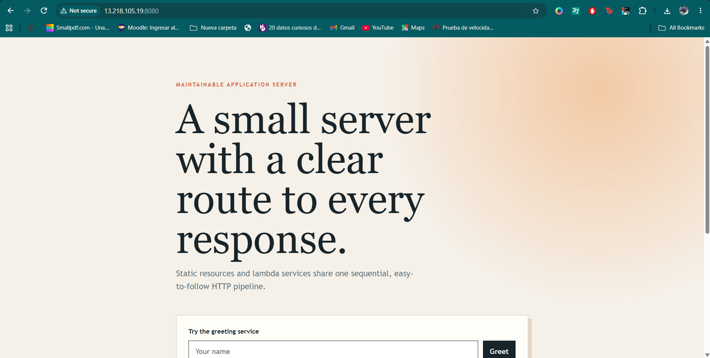

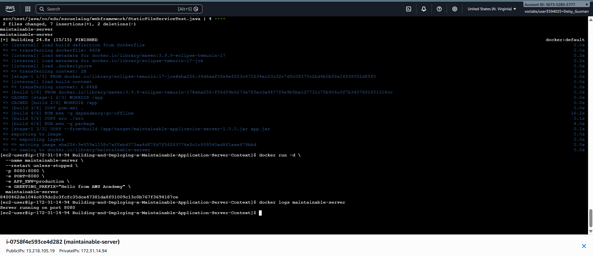

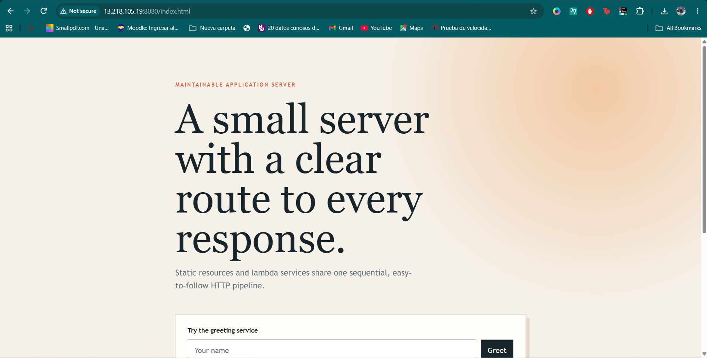

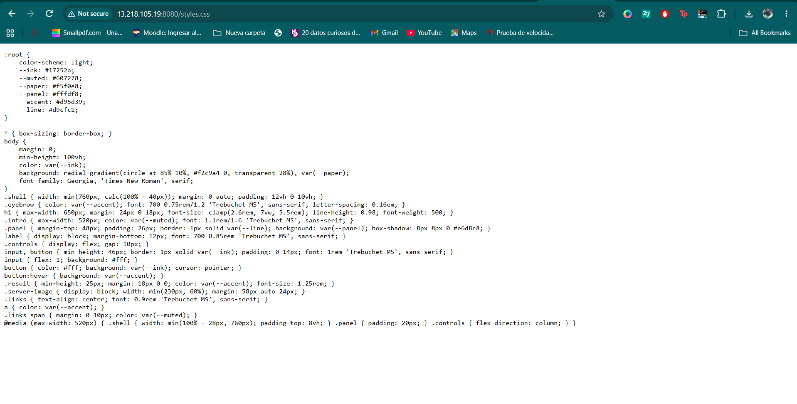

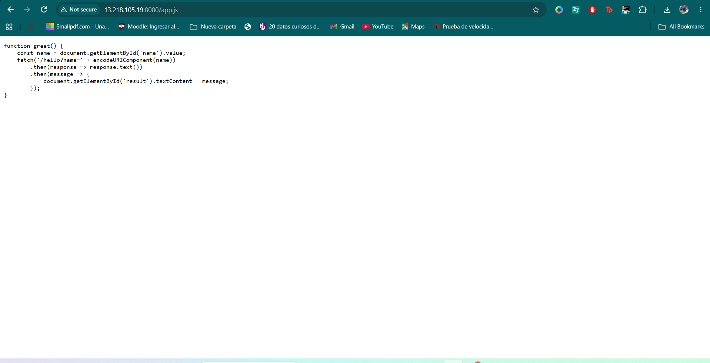

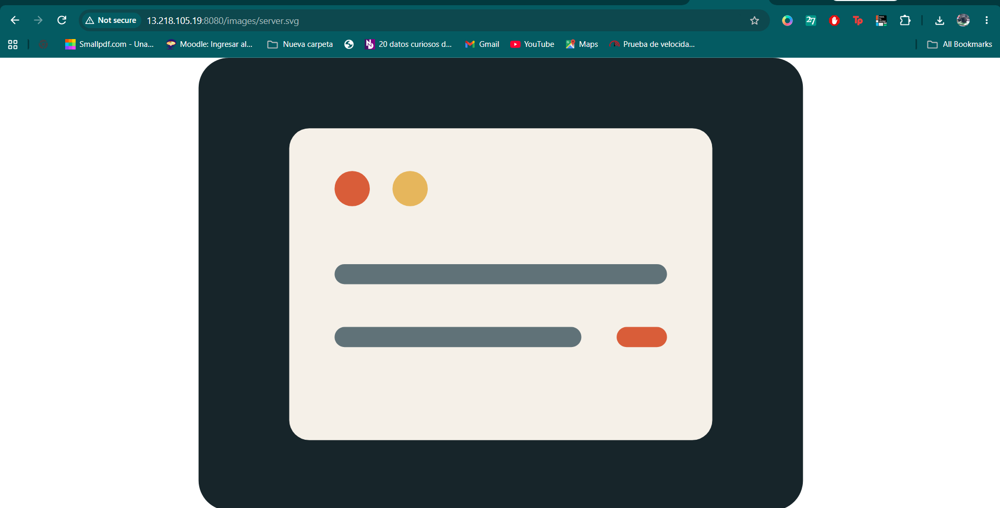

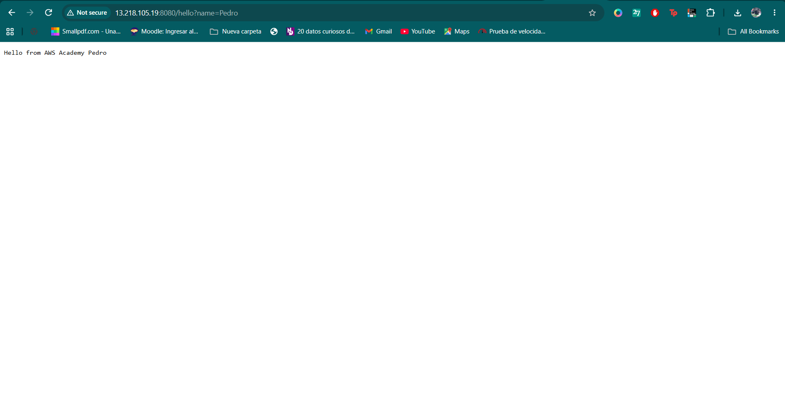

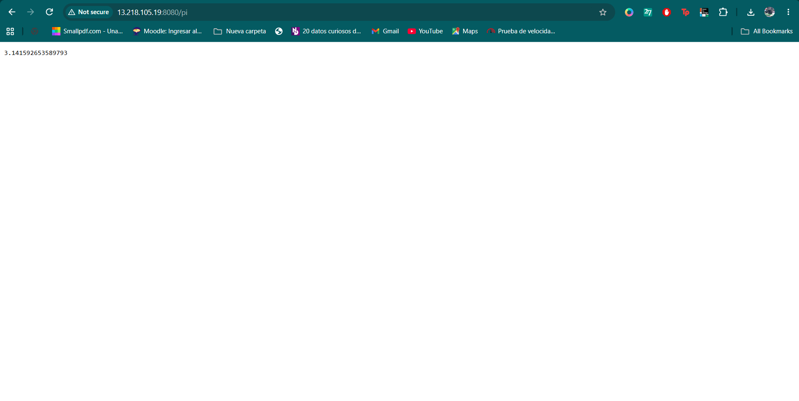

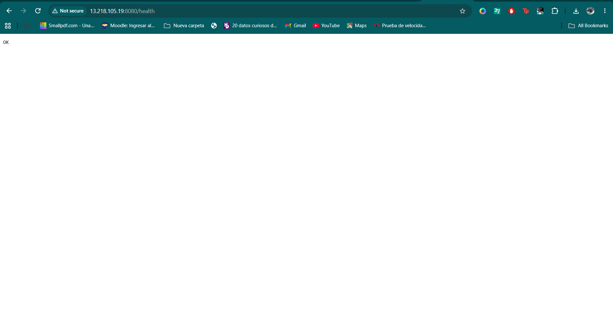

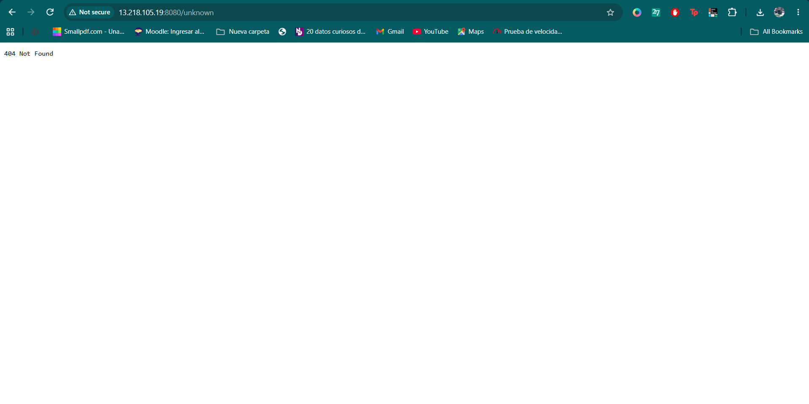

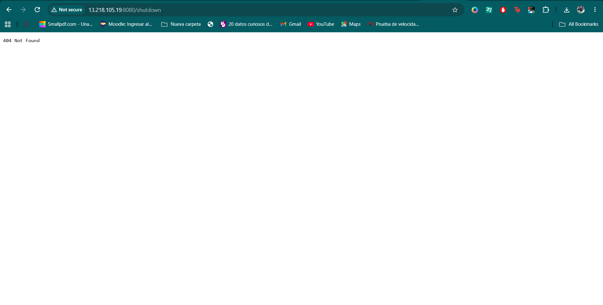

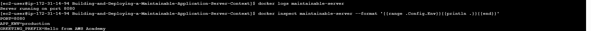